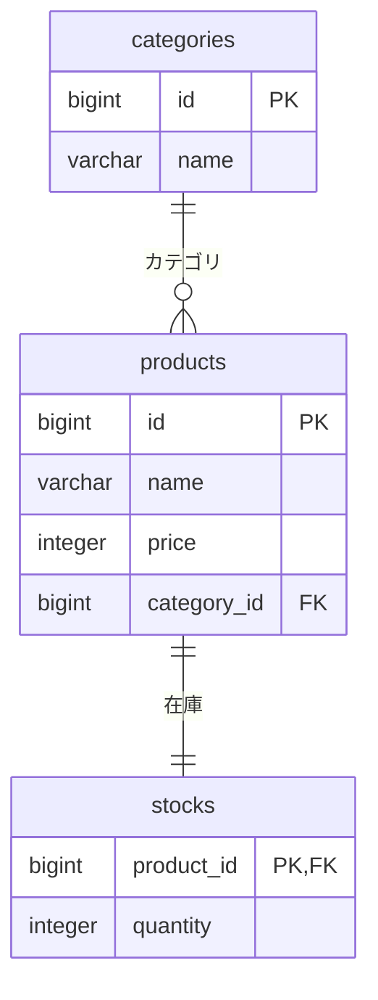

# DB・トランザクション設計

関連Issue：#13。3テーブル構成と条件付きUPDATEは合意済み。型・制約・初期インデックス・処理境界はレビュー用の提案。

## 1. テーブル

| テーブル | 列 | 型・制約 |
| --- | --- | --- |
| categories | id | bigint、主キー、IDENTITY |
| categories | name | varchar(100)、NOT NULL |
| products | id | bigint、主キー、IDENTITY |
| products | name | varchar(200)、NOT NULL |
| products | price | integer、NOT NULL、0以上。円単位 |
| products | category_id | bigint、NOT NULL、categories.idへの外部キー |
| stocks | product_id | bigint、主キー、products.idへの外部キー |
| stocks | quantity | integer、NOT NULL、0以上 |

- IDは正の値を生成する。
- 商品名・カテゴリ名は空文字を許可しない。
- 同じカテゴリ名・商品名のデータを許可する。
- すべての商品に在庫行を1件作り、試験開始前に欠損がないことを検証する。
- 外部キーは在庫行の存在自体を保証しない。商品と在庫の生成は同じトランザクションで行う。
- 基準測定中は商品・カテゴリの変更と在庫補充を行わず、減算のみ実行する。データの再投入は試験間に行う。
- IDはJavaのlong、価格・数量はintへ対応させる。APIのquantityは1〜2,147,483,647とする案。



## 2. 初期インデックスと検索

- 初期構成は各テーブルの主キーインデックスを使う。
- カテゴリ・価格・部分一致向けの追加インデックスは、基準測定後に個別に追加して比較する。
- 検索はproductsとcategoriesをJOINし、カテゴリ名を一括取得する。N+1は比較実験用の実装として別条件で測る。
- LIMITは指定件数＋1、OFFSETはAPIの指定値を使う。
- ORDER BYは`id ASC`、`price ASC, id ASC`、`price DESC, id ASC`からサーバー側で選ぶ。文字列をそのままSQLへ埋め込まない。
- 検索値はバインドする。部分一致はLIKEを使う案とし、ユーザーの`%`・`_`はエスケープして文字として扱う。
- 検索は1つのSELECTで実行する。複数ページ間でデータが変わる場合の一貫したスナップショットは保証しない。

## 3. 在庫減算

```sql
UPDATE stocks
SET quantity = quantity - :quantity
WHERE product_id = :productId
  AND quantity >= :quantity
RETURNING quantity;
```

- 入力検証後、Read Committedのトランザクションで実行する。
- 更新行のロックはUPDATEが取得する。先に在庫を読み取ってアプリで引き算しない。
- 同じ行を更新する要求は待機し、先行更新のコミット後に条件を再評価する。
- 1件返れば更新成功。コミット完了後に200と更新時点のquantityを返す。
- 0件の場合は同じトランザクション内で商品と在庫の存在を確認する。商品なしは404、在庫行なしは500、それ以外は在庫不足の409とする。
- 上記の0件判定は、試験中に商品・在庫の削除や補充を行わない条件に基づく。
- DB例外はトランザクションをロールバックし、共通エラー設計へ対応させる。コミット時の通信断では結果が不明になる場合がある。
- トランザクション内にHTTP応答・外部通信・計測データ送信を入れない。
- 再送は独立した減算となる。試験の負荷生成側で自動再試行しない。

## 4. 試験で確認すること

- 競合時もquantityが0以上であることを確認する。
- 障害のない試験では、最終在庫と成功応答の減算数量累計を照合する。
- 応答消失を含む障害試験では、成功応答数だけで成立更新を数えない。基準構成は3テーブルのままとし、DB側の成立更新を記録する方法を試験設計で決める。
- 接続数・ロック待ち・クエリ時間を計測し、分散アクセスと一商品への集中を比較する。
- 接続取得・ロック待ち・SQL実行のタイムアウト値は、計測構成の設計で決める。

## Refs

- [PostgreSQL：Read Committedと更新時の条件再評価](https://www.postgresql.org/docs/current/transaction-iso.html#XACT-READ-COMMITTED)
- [API設計](api.md)
- [共通エラー設計](errors.md)
