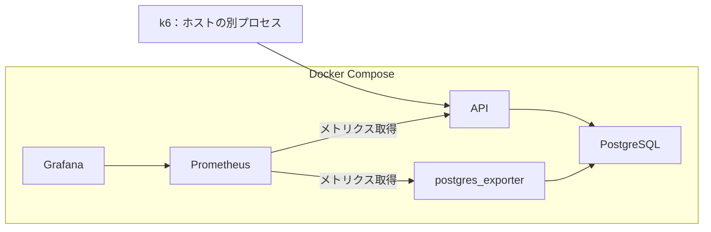

# 計測・試験構成

関連Issue：#13。Composeと別プロセスのk6は合意済み。資源・時間・負荷条件はレビュー用の初期案。

## 1. 構成

- API・DB・Prometheus・GrafanaをComposeで起動する。
- DBの接続数とロック待ちを観測するためpostgres_exporterを追加する案。
- k6はホスト上の別プロセスから公開されたAPIポートへ要求を送る。
- 同じホストなのでk6とコンテナはCPU・メモリを共有する。生成側の限界が疑われる場合は負荷生成を別ホストへ移す。
- APIメトリクスはActuator・Micrometer、クエリ集計はpg_stat_statements、詳細分析はJFRを使う。
- イメージ、JDK、ライブラリ、k6の版を固定して記録する。具体的な版は起動環境の実装前に確認する。

## 2. 初期条件

| 項目 | 提案値 |
| --- | --- |
| API | 2 CPU、メモリ1 GiB、JVMヒープ最大512 MiB |
| PostgreSQL | 2 CPU、メモリ2 GiB |
| Prometheus | 0.5 CPU、メモリ512 MiB |
| Grafana | 0.5 CPU、メモリ512 MiB |
| postgres_exporter | 0.25 CPU、メモリ256 MiB |
| HikariCP | 最大10接続、最小待機10接続 |
| Prometheus取得間隔 | 5秒 |
| ウォームアップ | 2分 |
| 基準測定 | 5分、同条件を3回 |
| 長時間運転 | 30分 |

- Composeの資源制限が実際に適用されているか確認する。
- Docker DesktopではVMへの割当、ホストの機種・OS・CPUアーキテクチャ・メモリも記録する。
- ホストの余裕を確認し、収まらない場合は最初の測定前に値を変更して固定する。
- API・DB・計測サービスを同じ条件に保ち、比較する変更は1つずつ行う。
- リクエスト全件のアクセスログを基準測定では無効にし、ログ条件を記録する。
- JFRなど詳細分析を有効にした試験は通常の性能測定と分ける。

## 3. タイムアウト

| 設定 | 初期案 |
| --- | --- |
| HikariCP connectionTimeout | 1秒 |
| DB接続確立 | 2秒 |
| PostgreSQL lock_timeout | 1秒 |
| PostgreSQL statement_timeout | 3秒 |
| JDBC通信の読み取り待ち | 5秒 |
| k6のHTTP待ち | 10秒 |

- lock_timeoutはロック待ち、statement_timeoutはSQL全体の実行時間を制限する。
- statement_timeoutは接続プール待ちを含まず、SQLごとに適用される。API全体の制限時間ではない。
- DB設定はアプリ接続へ適用し、データ投入・分析用接続の設定と分ける。
- タイムアウトによる打ち切り件数を記録する。遅いクエリの分析では制限を調整した別試験を行う。
- コミットの通信断やk6のタイムアウトでは更新結果が不明になる場合がある。減算は自動再試行しない。

## 4. データと負荷

- 商品10万件・100万件、カテゴリ100件を同じseedで生成する案。
- 商品名・価格・カテゴリの生成条件、キーワードごとのヒット率を記録する。
- 均等なカテゴリ分布と、特定カテゴリへ80%集中する分布を分けて試験する。
- 検索と減算はまず単独で測る。混合負荷は検索90%・減算10%から始める案。
- 検索は部分一致、カテゴリと価格、OFFSETの深さを個別に変える。
- 減算は数量1を固定し、商品への均等アクセスと、一商品へ80%集中するアクセスを比較する。
- 成功性能の試験では、各商品の予定減算回数を上回る在庫を用意する。売り切れの試験は別に行う。
- ウォームアップ後に在庫を試験開始値へ戻し、実行中の要求がないことを確認する。
- 各試験の前にANALYZEを実行する。キャッシュを温めた測定を基準とし、冷えた状態の測定は別に記録する。
- k6は1iterationで1要求を送るarrival-rate方式を使う。最初は10 RPSから増やす。
- 目標RPS、実送信数、dropped_iterations、生成側のCPU・メモリを記録する。要求を生成できなかった試験を目標負荷達成と扱わない。

## 5. 指標と結果

| 対象 | 記録する内容 |
| --- | --- |
| k6 | p95・p99、成功RPS、HTTPとコード別件数、タイムアウト・接続断、生成できなかった要求 |
| API | リクエスト時間、処理件数、JVMヒープ、GC、スレッド、Hikariの使用・待機接続 |
| コンテナ | CPU、メモリ、再起動、CPU制限による抑制 |
| DB | SQL呼出数・時間・読込、接続数、ロック待ち、デッドロック |

- SQL集計はpg_stat_statementsの試験前後の差分で取る。ロック待ちはpg_stat_activityなどから取得する。
- DBビュー参照の権限とexporterのカスタムクエリを実装時に設定する。
- コンテナ指標はdocker stats等で定期保存する。すべてが自動的にGrafanaへ出るとは扱わない。
- p95・p99はAPI・成功/拒否/障害別に集計し、全結果も併記する。
- 成功RPSは測定区間内に成功応答を受けた件数を区間の秒数で割る。
- エラー率はシステム障害と接続エラー等を実送信数で割る。業務上の拒否率は別に出す。
- タイムアウトした要求の完了時間は不明なので、応答時間の分布とタイムアウト率を一緒に評価する。
- 本測定と終了後の処理完了待ちを分けて記録する。
- 短い障害試験を月間可用性の実績として扱わない。

## 6. 整合性と障害試験

- 負荷を止めて実行中の処理が完了してから、商品ごとの開始在庫と最終在庫を照合する。
- 障害のない試験では、k6が記録した成功数量の累計と減算量が一致することを確認する。
- API停止は強制停止と再起動、DB遅延は別DBセッションの行ロック保持、接続枯渇は並行要求によるプール待ちとして個別に再現する。
- ロック遅延を一般的なDB全体の遅延と混同せず、注入方法を記録する。
- 障害試験では、検証専用の減算監査テーブルとstocksのAFTER UPDATEトリガーを追加する案。
- トリガーはproduct_id、OLD/NEWの数量、差分を同じトランザクションで保存する。ロールバックなら監査行も残らない。
- 試験終了後、監査数量の累計と在庫減算量を照合する。再送の重複排除には使わない。
- 監査の追加負荷があるため、監査付き障害試験と3テーブルの基準性能は分ける。
- 在庫非負、監査と最終在庫の一致、DB接続の回復、再起動後の検索・減算を確認する。
- 復旧時間は注入解除または再起動開始から、一定の確認負荷で5秒連続して成功するまでとする案。確認減算も監査対象にする。

## Refs

- [k6の負荷モデル](https://grafana.com/docs/k6/latest/using-k6/scenarios/concepts/open-vs-closed/)
- [PostgreSQLのタイムアウト](https://www.postgresql.org/docs/current/runtime-config-client.html)
- [DB設計](database.md)
