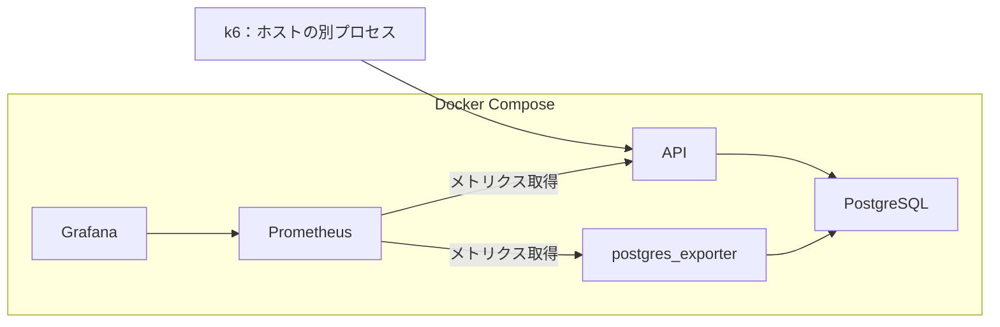

# 性能試験の実施内容

関連Issue：#13。数値は初期案。

## 共通設定

### 構成

- API・DB・計測サービスはCompose、k6はホストの別プロセスで起動する。
- APIはprometheus/client_golang、DBはpostgres_exporter・pg_stat_statementsで計測する。
- ホスト・Docker VMの資源割当と、ソフトウェアの版を記録する。

### 環境条件

| 項目 | 提案値 |
| --- | --- |
| API | 2 CPU、メモリ1 GiB |
| PostgreSQL | 2 CPU、メモリ2 GiB |
| Prometheus | 0.5 CPU、メモリ512 MiB |
| Grafana | 0.5 CPU、メモリ512 MiB |
| postgres_exporter | 0.25 CPU、メモリ256 MiB |
| pgxpool | 最大10接続、最小0接続 |
| Prometheus取得間隔 | 5秒 |

| 設定 | 初期案 |
| --- | --- |
| pgxpool.Acquireのcontext期限 | 1秒 |
| DB接続確立 | 2秒 |
| PostgreSQL lock_timeout | 1秒 |
| PostgreSQL statement_timeout | 3秒 |
| DB操作のcontext期限（取得後） | 5秒 |
| k6のHTTP待ち | 10秒 |

- 資源制限の適用を確認し、比較試験では環境・設定を固定する。
- DBタイムアウトはアプリ接続に適用する。statement_timeoutはSQL単位の制限とする。
- 基準測定は全件アクセスログを無効にし、pprofによる詳細分析は別に行う。
- プール取得は1秒、取得後のDB処理は5秒をcontextで制限する。接続確立はpgxのConnectTimeoutで制限する。
- 在庫減算は自動再試行しない。

### データ準備

- 同じseedで商品10万件・100万件、カテゴリ100件を生成する。
- 商品名・価格・カテゴリの生成条件と検索のヒット率を記録する。
- カテゴリ分布は均等と特定カテゴリへの80%集中を比較する。
- 検索・減算を単独で測り、混合負荷は検索90%・減算10%とする。
- 検索は部分一致・カテゴリ・価格・OFFSETの深さを変えて比較する。
- 減算は数量1とし、均等アクセスと一商品への80%集中を比較する。
- 予定減算量を上回る在庫を用意する。売り切れは別試験とする。
- 負荷試験前にANALYZEと2分のウォームアップを行い、処理完了後に在庫を初期化する。
- キャッシュを温めた状態を基準とし、冷えた状態は別に測定する。

### 実行と記録

- Smoke → Average-load → Stress → Spike → Soak → Breakpointの順に実施する。
- 負荷試験は1iterationにつき1要求を送る到着率方式とする。一定負荷はconstant-arrival-rate、増減はramping-arrival-rateを使う。
- 各試験のデータ・要求条件、RPS、増減時間、維持時間、終了条件を記録する。
- 試験後は処理完了・在庫整合性・環境の回復を確認する。
- 改善前後は同じ条件で比較する。

### 計測指標

| 対象 | 記録する内容 |
| --- | --- |
| k6 | p95・p99、成功RPS、HTTPとコード別件数、タイムアウト・接続断、生成できなかった要求 |
| API | リクエスト時間、処理件数、Goヒープ、GC、goroutine、pgxpoolの使用接続・取得待ち |
| コンテナ | CPU、メモリ、再起動、CPU制限による抑制 |
| DB | SQL呼出数・時間・読込、接続数、ロック待ち、デッドロック |

- p95・p99はAPI・成功・業務拒否・障害別と全体で集計する。タイムアウト率も併記する。
- 成功RPSは測定区間の成功応答数÷秒数、エラー率はシステム・通信障害数÷実送信数とする。業務拒否率は別に記録する。
- 目標RPS・実送信数・dropped_iterations・k6のCPUとメモリを記録し、負荷生成側の限界を区別する。
- SQLはpg_stat_statementsの前後差分、ロック待ちはpg_stat_activityを使う。exporterに必要なクエリ・権限を設定する。
- コンテナ指標はdocker stats等で保存する。測定区間と終了後の処理待ちは分ける。

## 1. Smoke（スモークテスト）

### 条件

- 正常・異常の確認用データを使い、少数の要求を送る。

### 実施内容

- 検索結果、減算結果、入力不正・商品不存在・在庫不足のエラーを確認する。
- k6の結果とPrometheus・Grafanaの計測を確認し、成功後に負荷試験へ進む。

## 2. Average-load（通常負荷テスト）

### 条件

- 10 RPSから初期測定し、通常負荷を決める。
- 通常負荷を5分維持し、同条件で3回測定する。

### 実施内容

- 通常負荷まで徐々に増やし、性能・資源使用量の基準値を記録する。

## 3. Stress（ストレステスト）

### 条件

- 通常負荷より高いピークRPSと増減・維持時間を設定する。

### 実施内容

- ピーク負荷まで徐々に増やして維持し、通常負荷へ戻す。
- 高負荷時の遅延・エラー・資源使用量と回復を確認する。

## 4. Spike（スパイクテスト）

### 条件

- 通常時・急増時のRPSと増減・維持時間を設定する。

### 実施内容

- 負荷を急増させて維持し、通常負荷へ戻す。
- 急増時の遅延・エラー・接続待ちと回復を確認する。

## 5. Soak（長時間耐久テスト）

### 条件

- 通常負荷を30分維持する。

### 実施内容

- メモリ・GC・DB接続の推移と、時間経過による性能劣化を確認する。

## 6. Breakpoint（限界試験）

### 条件

- 開始RPS、増加量、維持時間、遅延・エラー率・資源使用量の停止条件を設定する。

### 実施内容

- 負荷を段階的に増やし、成功RPSの頭打ちと遅延・エラーの増加を記録する。
- 停止条件に達したら負荷を下げ、回復を確認する。

## 整合性と障害試験

- 処理完了後に在庫非負と、開始在庫−成功減算量＝最終在庫を確認する。
- API強制停止・再起動、別DBセッションによる行ロック保持、並行要求による接続プール枯渇を個別に試験する。
- 障害試験では監査テーブルとstocksのAFTER UPDATEトリガーを追加する案。商品ID・更新前後の数量・差分を在庫更新と同じトランザクションで保存する。
- 応答を失った減算も含め、監査の減算累計と最終在庫を照合する。監査付き試験は基準性能測定と分ける。
- 復旧時間は障害解除・再起動開始から、確認要求が5秒連続で成功するまでとする。確認減算も監査する。

## Refs

- [Goの技術選定](../adr/0002-go-performance-learning-stack.md)

- [k6のテスト種別](https://grafana.com/docs/k6/latest/testing-guides/api-load-testing/)
- [k6の負荷モデル](https://grafana.com/docs/k6/latest/using-k6/scenarios/concepts/open-vs-closed/)
- [PostgreSQLのタイムアウト](https://www.postgresql.org/docs/current/runtime-config-client.html)
- [DB設計](database.md)
